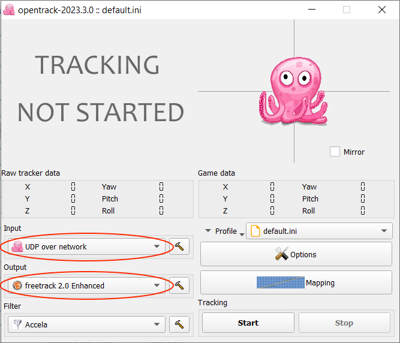
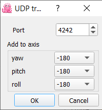
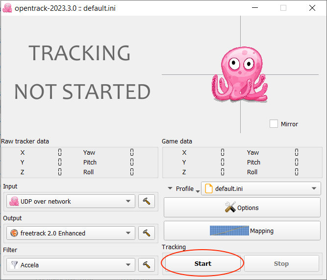

# airpods-head-tracking
This Swift app runs on macOS, captures yaw, pitch, roll from AirPods, and streams them over UDP to a target PC running OpenTrack.


## Usage
1. Install [OpenTrack](https://github.com/opentrack/opentrack/releases/tag/opentrack-2023.3.0) on target PC.
2. Open OpenTrack and configure:
   - Set **Input** to **UDP over network**.
   - Set **Output** to **freetrack 2.0 Enhanced**.

  
   - In-game, your input will be mirrored. To prevent this, go to **Input** settings and set all **"Add to axis"** values to **-180**.

  
  - Press **Start**.

  
  
3. Install [the release](https://github.com/AndressDanylo/airpods-head-tracking/releases/tag/v1.0) on your Mac.
4. Open it and enter your target PC's IP and port(by default the OpenTrack input port is 4242) in the corresponding fields.
5. Connect your AirPods to your Mac and launch the game.
6. Enjoy your game!
   
⚠️ Notice: To receive UDP packets, you may need to disable your firewall or allow traffic on port 4242 on your target PC.

## Building
```bash
git clone https://github.com/AndressDanylo/airpods-head-tracking.git
cd airpods-head-tracking/src
swiftc main.swift -o headtrack
```

### Vibecoded with ❤️
